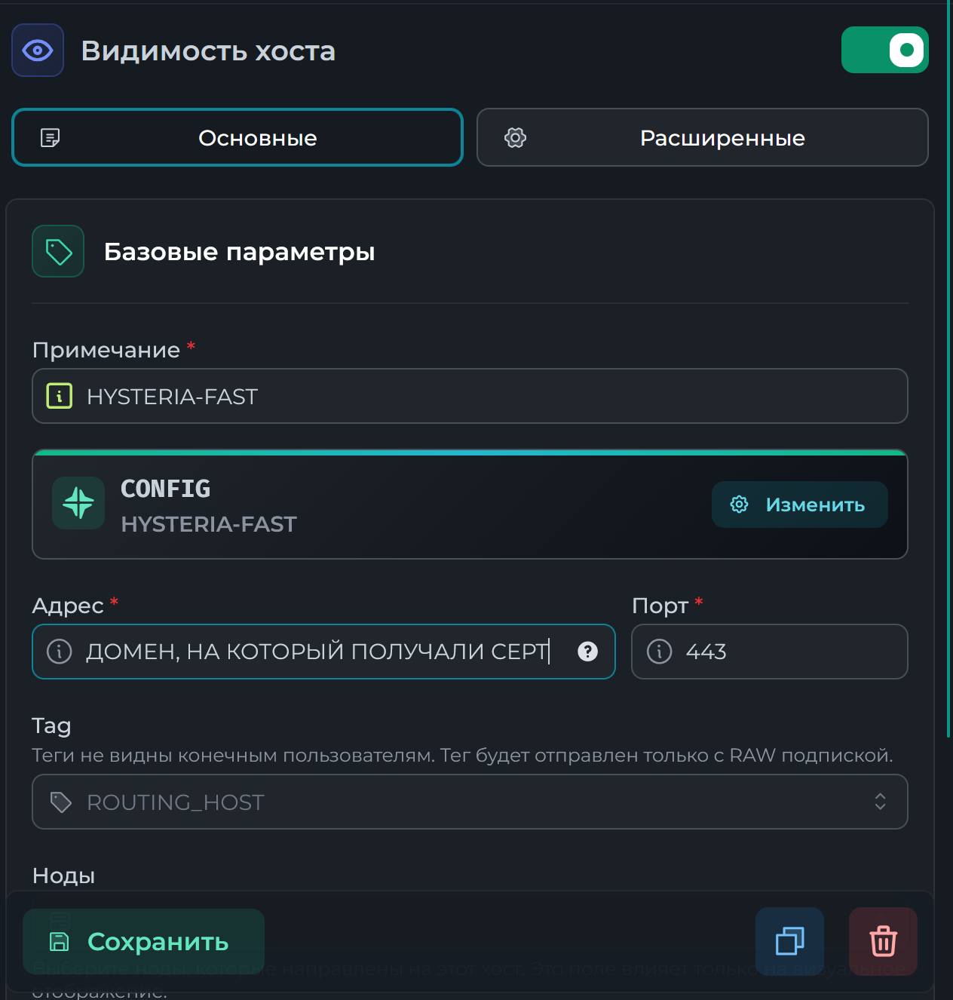
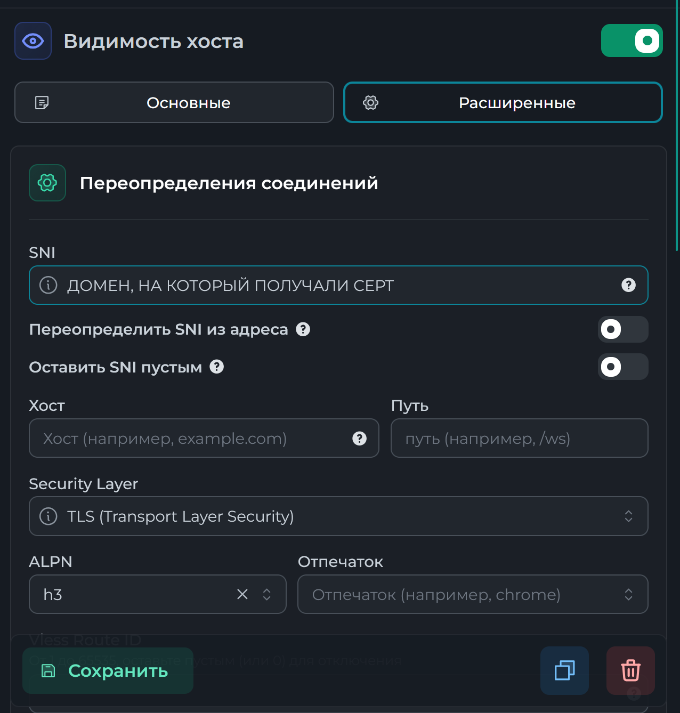
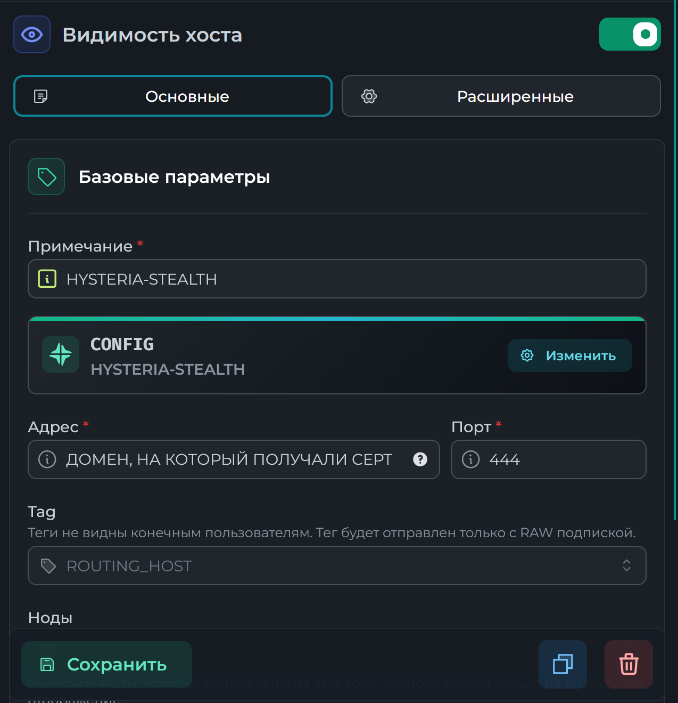
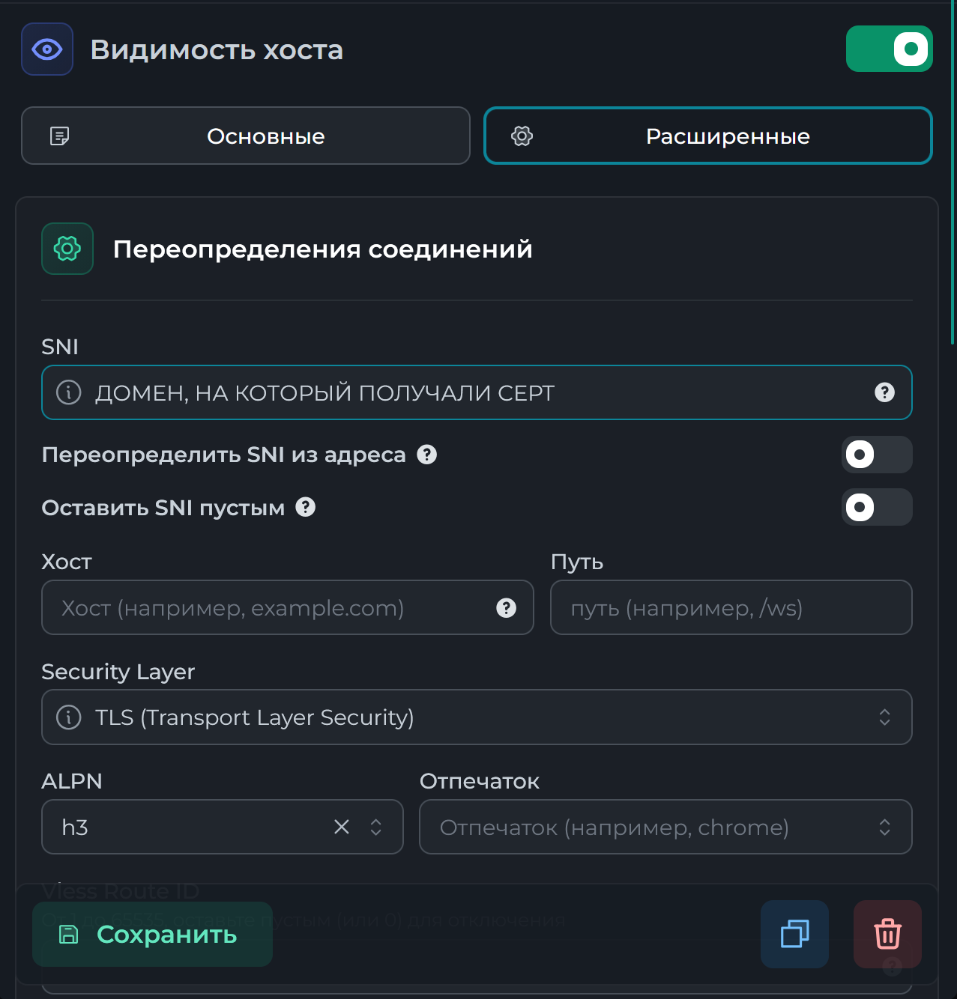

## Шаг 1. Подготавливаем ноду для Hysteria2

> #### **Для выполнения этого шага потребуется домен, адресующий на IP ноды**
> 
---

Для установки можно воспользоваться скриптом, повторяет описанные далее действия
```
bash <(curl -s https://raw.githubusercontent.com/corequadz/configs/main/Remnanode/install_hysteria2.sh)
```

---

1. Останавливаем Caddy (если был)
```
docker stop caddy-remnawave
```
2. Получаем сертификаты для домена
```
apt install certbot -y
certbot certonly --standalone -d ваш_домен
```
3. Создаем папку для сертификатов и переносим их туда
```
mkdir -p /opt/remnawave/nginx 
```

```
cp -L /etc/letsencrypt/live/ваш_домен/fullchain.pem /opt/remnawave/nginx/fullchain.pem
```

```
cp -L /etc/letsencrypt/live/ваш_домен/privkey.pem /opt/remnawave/nginx/privkey.key
```

Проверяем 
```
ls -l /opt/remnawave/nginx

fullchain.pem
privkey.key
```

4. В docker-compose ноды добавляем
```
	volumes:
	 - /opt/remnawave/nginx:/var/lib/remnawave/configs/xray/ssl
```

5. Перезапускаем ноду
```
cd /opt/remnanode && docker compose down && docker compose up -d && docker compose logs -f
```
6. Запускаем caddy
```
docker start caddy-remnawave
```
##### Опционально. Ротация портов
1. Открываем нужные порты
```
ufw allow 443/udp && ufw allow 444/udp && ufw allow 20000:50000/udp
```
2. Создаем правило проброса портов
```
iptables -t nat -A PREROUTING -p udp --dport 20000:50000 -j REDIRECT --to-ports 444
```
3. Сохраняем правило
```
apt install -y iptables-persistent
netfilter-persistent save
```
## Шаг 2. Настройка конфигурации

> #### **Для выполнения этого шага требуется установленная и настроенная нода**

1. В панели переходим на вкладку профили, создаем новый профиль **CONFIG**

2. Вставляем конфиг (здесь предложены 2 варианта - с упором на скорость работы или на безопасность соединения):
```
{
  "log": {
    "loglevel": "warning"
  },
  "inbounds": [
    {
      "tag": "HYSTERIA-FAST",
      "port": 443,
      "listen": "0.0.0.0",
      "protocol": "hysteria",
      "settings": {
        "clients": [],
        "version": 2
      },
      "streamSettings": {
        "network": "hysteria",
        "security": "tls",
        "finalmask": {
          "quicParams": {
            "congestion": "bbr"
          }
        },
        "tlsSettings": {
          "alpn": [
            "h3"
          ],
          "certificates": [
            {
              "keyFile": "/var/lib/remnawave/configs/xray/ssl/privkey.key",
              "certificateFile": "/var/lib/remnawave/configs/xray/ssl/fullchain.pem"
            }
          ]
        },
        "hysteriaSettings": {
          "version": 2,
          "bandwidth": {
            "up": 300,
            "down": 300
          },
          "ignoreClientBandwidth": true
        }
      }
    },
    {
      "tag": "HYSTERIA-STEALTH",
      "port": 444,
      "listen": "0.0.0.0",
      "protocol": "hysteria",
      "settings": {
        "clients": [],
        "version": 2
      },
      "streamSettings": {
        "network": "hysteria",
        "security": "tls",
        "finalmask": {
          "quicParams": {
            "congestion": "bbr"
          }
        },
        "tlsSettings": {
          "alpn": [
            "h3"
          ],
          "certificates": [
            {
              "keyFile": "/var/lib/remnawave/configs/xray/ssl/privkey.key",
              "certificateFile": "/var/lib/remnawave/configs/xray/ssl/fullchain.pem"
            }
          ]
        },
        "hysteriaSettings": {
          "obfs": {
            "type": "salamander",
            "password": "сгенерируй здесь в ML-KEM768 Client side"
          },
          "version": 2,
          "bandwidth": {
            "up": 300,
            "down": 300
          },
          "masquerade": {
            "type": "proxy",
            "proxy": {
              "url": "google.com"
            }
          },
          "udpIdleTimeout": 60,
          "ignoreClientBandwidth": false
        }
      }
    }
  ],
  "outbounds": [
    {
      "tag": "direct",
      "protocol": "freedom"
    },
    {
      "tag": "block",
      "protocol": "blackhole"
    }
  ],
  "routing": {
    "rules": [
      {
        "ip": [
          "geoip:private"
        ],
        "type": "field",
        "outboundTag": "block"
      },
      {
        "type": "field",
        "domain": [
          "geosite:private"
        ],
        "outboundTag": "block"
      },
      {
        "type": "field",
        "protocol": [
          "bittorrent"
        ],
        "outboundTag": "block"
      }
    ],
    "domainStrategy": "IPIfNonMatch"
  }
}
```
Сохраняем
2. Переходим во вкладку **Хосты**, создаем 2 хоста: 
##### **Хост 1. HYSTERIA-FAST**



##### **Хост 2. HYSTERIA-STEALTH**



#### 3. Выставляем у ноды созданный конфиг, добавляем в сквады, готово!

#### Описание параметров для Hysteria 2
### `bandwidth`

```
"bandwidth": {  
  "up": 300,  
  "down": 300  
}
```

- Ограничивает максимальную скорость передачи данных со стороны сервера
- Значения указываются в Mbps

**Рекомендации:**
- для выделенного канала (dedicated) — ставить близко к реальной скорости
- для fair-share — уменьшать в ~1.5–2 раза

---

### `ignoreClientBandwidth`

```
"ignoreClientBandwidth": true
```

- Определяет, учитывать ли ограничения клиента
- `true` — используются только серверные лимиты
- `false` — клиент может влиять на скорость

**Рекомендация:**  
использовать `true` для контроля нагрузки

---

### `obfs`

```
"obfs": {  
  "type": "salamander",  
  "password": "..."  
}
```

- Обфускация трафика
- `password` — ключ обфускации

**Рекомендации:**

- включать в сетях с DPI

---

### `masquerade`

```
"masquerade": {  
  "type": "proxy",  
  "proxy": {  
    "url": "https://example.com"  
  }  
}
```

- Маскировка под HTTPS-трафик

**Рекомендации:**
- Не использовать selfsteal-домен

---

### `udpIdleTimeout`

```
"udpIdleTimeout": 60
```

- Таймаут неактивности UDP (секунды)

**Рекомендации:**

- 60–120 — стандарт
- больше → стабильнее долгие соединения
- меньше → быстрее очистка

---

### `congestion`

```
"congestion": "bbr"
```

- Алгоритм управления перегрузкой

**Рекомендация:**  
оставлять `bbr` (оптимален в большинстве случаев)
