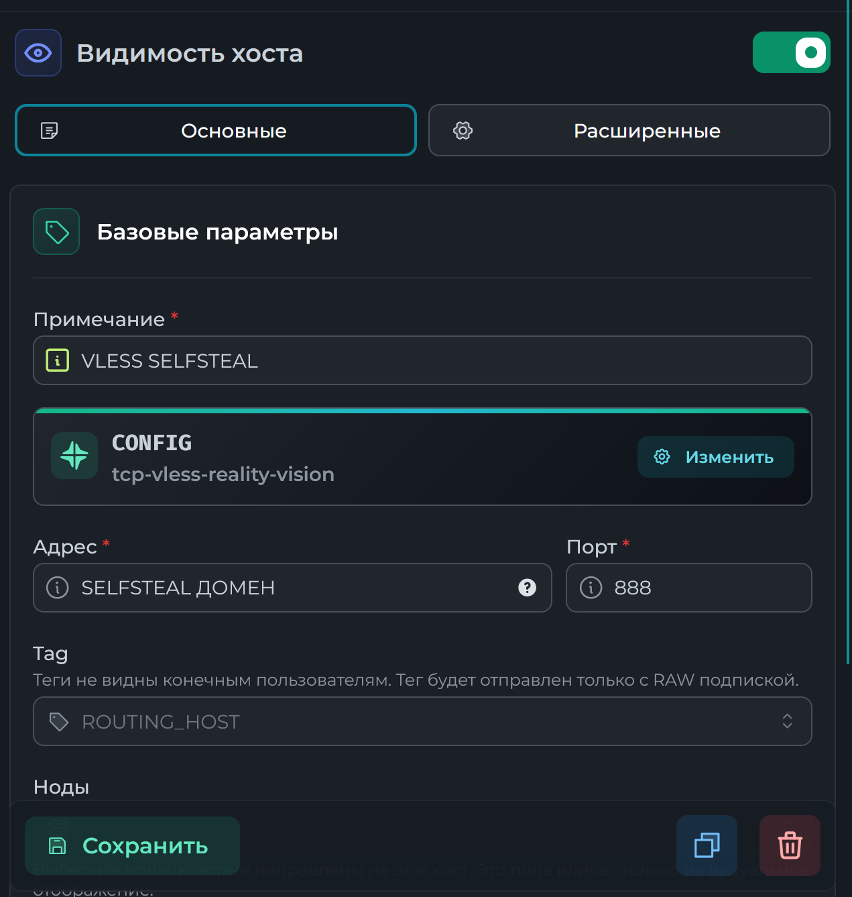
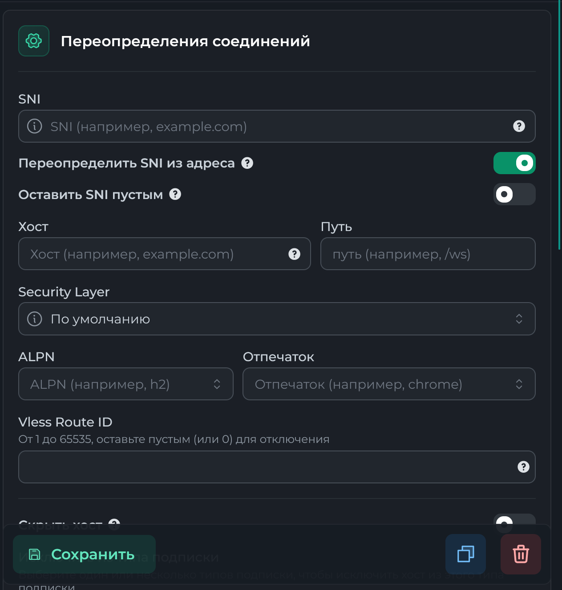

# Настраиваем Remnanode с selfsteal-конфигом

## Шаг 1. Первичная установка

1. Устанавливаем Docker
```
sudo curl -fsSL https://get.docker.com | sh	
```
2. Создаем рабочую директорию и открываем docker-compose файл
```
mkdir /opt/remnanode && cd /opt/remnanode && cd /opt/remnanode && nano docker-compose.yml
```
3. Переходим в панель, Ноды -> Управление. Нажимаем на + и вводим данные ноды, после чего нажимаем **Копировать docker-compose.yml**.
4. Вставляем конфигурацию в наш docker-compose, сохраняем
5. Запускаем ноду 
```
docker compose up -d && docker compose logs -f
```
После завершения загрузки, в панели нажимаем **Далее**, выбираем любой хост и подключаем ноду.

## Шаг 2. Настраиваем Selfsteal-конфигурацию

> #### **Для выполнения этого шага потребуется домен, адресующий на IP ноды**
>  Инструкция взята с [репозитория](https://github.com/IadjustI/remnawave_selfsteal_guide/blob/main/README.md) 

---

Для установки можно воспользоваться скриптом, повторяет описанные далее действия
```
bash <(curl -s https://raw.githubusercontent.com/corequadz/configs/main/Remnanode/install_selfsteal.sh)
```

---

1. Создаем рабочую директорию и Caddyfile
```
mkdir -p /opt/selfsteal && cd /opt/selfsteel && nano Caddyfile
```

> Caddyfile
```
{
    https_port {$SELF_STEAL_PORT}
    default_bind 127.0.0.1
    servers {
        listener_wrappers {
            proxy_protocol {
                allow 127.0.0.1/32
            }
            tls
        }
    }
    auto_https disable_redirects
}

http://{$SELF_STEAL_DOMAIN} {
    bind 0.0.0.0
    redir https://{$SELF_STEAL_DOMAIN}{uri} permanent
}

https://{$SELF_STEAL_DOMAIN} {
    root * /var/www/html
    try_files {path} /index.html
    file_server

}

:{$SELF_STEAL_PORT} {
    tls internal
    respond 204
}

:80 {
    bind 0.0.0.0
    respond 204
}
```

2. Создаем файл конфигурации
```
nano .env
```

> .env
```
SELF_STEAL_DOMAIN=ВАШ_ДОМЕН # ОБЯЗАТЕЛЬНО ДОЛЖЕН СОВПАДАТЬ С ДОМЕНОМ В КОНФИГУРАЦИИ
SELF_STEAL_PORT=9443 # ОБЯЗАТЕЛЬНО ДОЛЖЕН СОВПАДАТЬ С ПОРТОМ В КОНФИГУРАЦИИ
```

3. Создаем docker-compose файл
> docker-compose.yml
```
services:
  caddy:
    image: caddy:latest
    container_name: caddy-remnawave
    restart: unless-stopped
    volumes:
      - ./Caddyfile:/etc/caddy/Caddyfile
      - ../html:/var/www/html
      - ./logs:/var/log/caddy
      - caddy_data_selfsteal:/data
      - caddy_config_selfsteal:/config
    env_file:
      - .env
    network_mode: "host"

volumes:
  caddy_data_selfsteal:
  caddy_config_selfsteal:
```
4. Запускаем контейнер
```
docker compose up -d && docker compose logs -f -t
```

5. Создаем сайт-заглушку
```
mkdir -p /opt/html
printf '%s\n' '<!doctype html><meta charset="utf-8"><title>Selfsteal</title><h1>It works.</h1>' \
  > /opt/html/index.html
```

## Шаг 3. Подготавливаем ноду для Hysteria2

> #### **Для выполнения этого шага потребуется домен, адресующий на IP ноды, отличный от домена из шага 2**
> 

Для установки можно воспользоваться скриптом, повторяет описанные далее действия
```
bash <(curl -s https://raw.githubusercontent.com/corequadz/configs/main/Remnanode/install_hysteria2.sh)
```

1. Останавливаем Caddy
```
docker stop caddy-remnawave
```
2. Получаем сертификаты для домена
```
apt install certbot -y
certbot certonly --standalone -d ваш_домен
```
3. Создаем папку для сертификатов и переносим их туда
```
mkdir -p /opt/remnawave/nginx 
```

```
cp -L /etc/letsencrypt/live/ваш_домен/fullchain.pem /opt/remnawave/nginx/fullchain.pem
```

```
cp -L /etc/letsencrypt/live/ваш_домен/privkey.pem /opt/remnawave/nginx/privkey.key
```

Проверяем 
```
ls -l /opt/remnawave/nginx

fullchain.pem
privkey.key
```

4. В docker-compose ноды добавляем
```
	volumes:
	 - /opt/remnawave/nginx:/var/lib/remnawave/configs/xray/ssl
```

5. Перезапускаем ноду
```
cd /opt/remnanode && docker compose down && docker compose up -d && docker compose logs -f
```
6. Запускаем caddy
```
docker start caddy-remnawave
```
##### Опционально. Ротация портов для Hysteria
1. Открываем нужные порты
```
ufw allow 443/udp && ufw allow 444/udp && ufw allow 20000:50000/udp
```
2. Создаем правило проброса портов
```
iptables -t nat -A PREROUTING -p udp --dport 20000:50000 -j REDIRECT --to-ports 444
```
3. Сохраняем правило
```
apt install -y iptables-persistent
netfilter-persistent save
```
## Шаг 4. Настройка конфигурации

> #### **Для выполнения этого шага требуется установленная и настроенная нода**

1. В панели переходим на вкладку профили, создаем новый профиль **CONFIG**

2. Вставляем конфиг:
```
{
  "log": {
    "loglevel": "warning"
  },
  "inbounds": [
    {
      "tag": "tcp-vless-reality-vision",
      "port": 888,
      "listen": "0.0.0.0",
      "protocol": "vless",
      "settings": {
        "clients": [],
        "decryption": "none"
      },
      "sniffing": {
        "enabled": true,
        "destOverride": [
          "http",
          "tls",
          "quic"
        ]
      },
      "streamSettings": {
        "network": "tcp",
        "security": "reality",
        "realitySettings": {
          "dest": "9443",
          "shortIds": [
            "",
            "сгенерируйте через openssl rand -hex 8"
          ],
          "privateKey": "сгенерируйте здесь в X25519",
          "serverNames": [
            "домен, заданный при настройке selfsteal"
          ]
        }
      }
    }
  ],
  "outbounds": [
    {
      "tag": "direct",
      "protocol": "freedom"
    },
    {
      "tag": "block",
      "protocol": "blackhole"
    }
  ],
  "routing": {
    "rules": [
      {
        "ip": [
          "geoip:private"
        ],
        "type": "field",
        "outboundTag": "block"
      },
      {
        "type": "field",
        "domain": [
          "geosite:private"
        ],
        "outboundTag": "block"
      },
      {
        "type": "field",
        "protocol": [
          "bittorrent"
        ],
        "outboundTag": "block"
      }
    ],
    "domainStrategy": "IPIfNonMatch"
  }
}
```
Сохраняем
2. Переходим во вкладку **Хосты**, создаем хост: 
##### *VLESS SELFSTEAL**


##### 3. Выставляем у ноды созданный конфиг, добавляем в сквады, готово!
